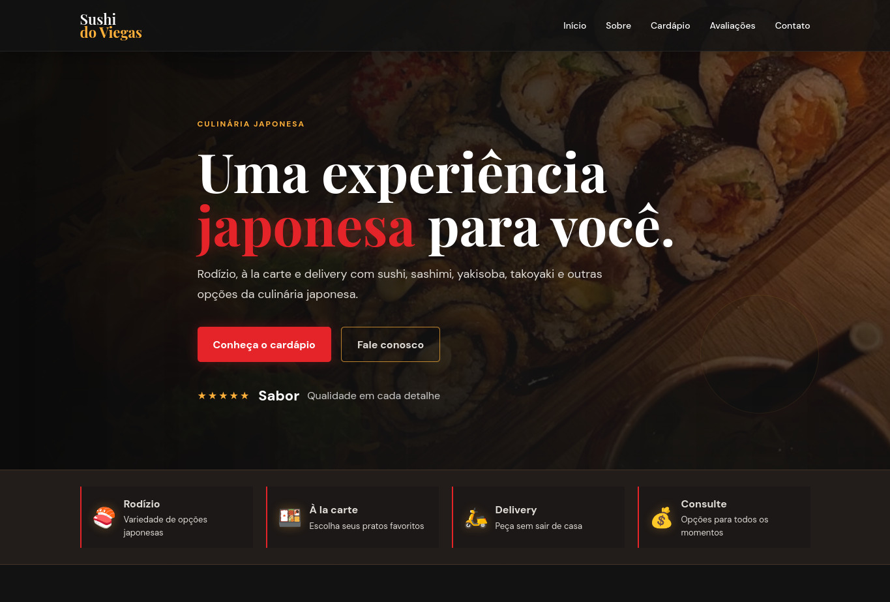
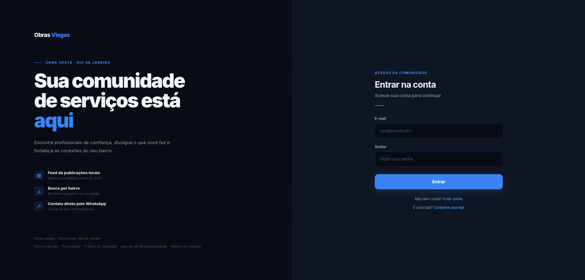
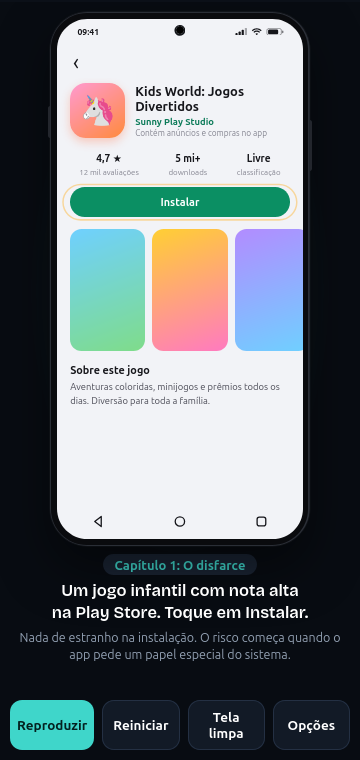
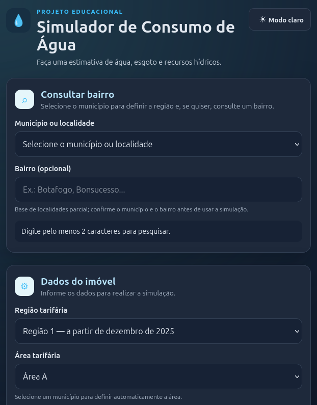

# 👋 Meus Projetos

Portfólio com os projetos que desenvolvi, organizados por categoria e stack.

---

## 🌐 Sites institucionais / Landing pages

### 🍰 [Doceria dos Sonhos](https://github.com/eduardow890-droid/Doceria-dos-Sonhos)
Site institucional de uma doceria, apresentando produtos, informações da empresa e canais de contato.
- **Stack:** HTML, CSS
- **Demo:** https://eduardow890-droid.github.io/Doceria-dos-Sonhos/

### 🍪 [Cookie Gostoso](https://github.com/eduardow890-droid/Cookie-Gostoso)
Site para uma marca fictícia de cookies artesanais, com portfólio de produtos, design responsivo, animações ao scroll e contato via WhatsApp para encomendas.
- **Stack:** HTML, CSS, JavaScript

### 🍣 [Sushi Viegas](https://github.com/eduardow890-droid/SushiViegas)

Site (PassarelaSushi) para um restaurante de sushi, com galeria de fotos do ambiente e dos pratos.
- **Stack:** HTML, CSS, JavaScript

### 🏗️ [Obras do Viegas](https://github.com/eduardow890-droid/ObrasDoViegas)
Página institucional para uma empresa de obras/construção.
- **Stack:** HTML

### 🤝 [Instituto Confia](https://github.com/eduardow890-droid/InstitutoConfia)
Site institucional com galeria de fotos, apresentando a atuação de um instituto/organização.
- **Stack:** HTML

---

## 🖥️ Sistemas web

### 🏠 [Obras Viegas (sistema)](https://github.com/eduardow890-droid/ObrasViegas)

Plataforma web de classificados locais para moradores, profissionais e lojas da comunidade de Viegas e região, com publicação de anúncios/serviços e contato direto pelo WhatsApp.
- **Funcionalidades:** cadastro/login de usuários e lojas, feed de publicações com imagens, busca por bairro/tipo, edição de perfil e posts, área comercial para lojas
- **Segurança:** senhas com hash bcrypt, sessões persistidas no PostgreSQL, rate limit de login, headers de segurança (Helmet/CSP), validação de uploads por MIME e magic bytes
- **Stack:** Node.js, Express 5, PostgreSQL, Supabase (banco e Storage), HTML/CSS/JS puro
- **Infra:** hospedado no Render, testes unitários e de integração automatizados

### 🎵 [MusicFree](https://github.com/eduardow890-droid/MusicFree)
Aplicação web com servidor próprio, autenticação (login) e testes automatizados.
- **Stack:** JavaScript, Node.js

### ⚽ [SGF — Sistema de Gerenciamento de Futebol](https://github.com/eduardow890-droid/SGF)
Sistema para gerenciamento de equipes de futebol: cadastro de atletas, controle de presença e registro de treinamentos.
- **Stack:** Python, HTML, SQLite

### 📋 [Sistema de Cadastro](https://github.com/eduardow890-droid/Sistema-de-Cadastro)
Sistema com cadastro, consulta e dashboard, com autenticação e persistência local de dados.
- **Stack:** HTML, JavaScript

---

## 🎮 Simuladores e projetos interativos

### 📱 [Celular Digital Didático](https://github.com/eduardow890-droid/CelularDigitalDidatico)

Simulação interativa de um celular Android, usada para demonstrar em vídeo casos reais (ex: remoção de adware disfarçado de aplicativo infantil).
- **Stack:** HTML

### 💧 [Simula Água](https://github.com/eduardow890-droid/simula-agua)

Simulador educacional para estimativa de tarifas de água, esgoto e recursos hídricos (Águas do Rio), com cálculo por faixas de consumo e regiões.
- **Stack:** HTML, CSS, JavaScript

### ❤️ [Nossos Momentos](https://github.com/eduardow890-droid/Nossos-Momentos)

Site interativo para reunir e compartilhar momentos especiais através de fotos, mensagens e recordações, com elementos de mapa/jogo (locais como casa, escola, condomínio).
- **Stack:** HTML, CSS, JavaScript

---

## 🛠️ Tecnologias que uso

- HTML / CSS / JavaScript
- Node.js
- Python
- SQL / SQLite
- Supabase

---

## 📫 Contato

- ✉️ E-mail: wagner.eduardo2025@outlook.com
- 💻 GitHub: [@eduardow890-droid](https://github.com/eduardow890-droid)
